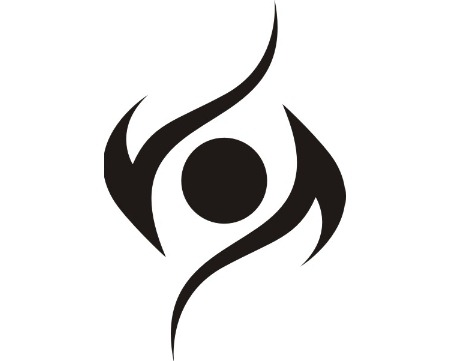

<h1 align="center">
  
   
  eyeSafe - Keep you and eye Safe.
   
   
</h1>

  
  
  

### Check it out!

<table style="border-collapse: separate;"><tr>
  <td style="border-spacing:2em 0"> 
        
  </td>
  <td style="border-spacing:2em 0"> 
      

  </td>
</tr></table>

## To run locally:
- Clone this Repo
- `cd eyeSafe/flask`
- Start flask server
`$flask run`
- Upload extension/ folder to Chrome extension
- Go to 127.0.0.1:5000
- Browse!

## HealthTrack
## Inspiration
As many of us have been lucky enough to quarantine indoors for school and work, the amount of time spent on screens have skyrocketed. Doctors estimate that healthy blinking rates are 15-20 times per minute; however while using a computer, our blinking rates are about 1/3 of the healthy rate. This leads to eye strain, dryness, and unhealthy eye habits. We take on this challenge to influence human behavior with computer vision technology.

## What it does
eyeSafe uses your computer webcam to detect how often you blink. As you work at your computer, if the program detects that you have been underperforming in your blink rate it deploys changes to your browser. 
- performs active content enhancement to promote healthier blinking behavior
- encourages the doctors' recommended 20/20/20 rule by a fun challenge
- produces analytics over the timespan that you use the application. 

## How we built it
We used the following technologies:
- openCV (python) to continually detect and count the blinks from the video stream. We used the eye-aspect ratio (EAR) metric to detect blinks [cited here (2016)](https://vision.fe.uni-lj.si/cvww2016/proceedings/papers/05.pdf)
- flask to serve the extension
- chrome extension to interface with the user to start the service

## Challenges we ran into
Streaming video data from a web browser to a flask server was a challenging aspect of the project. 

## Accomplishments that we're proud of
We've reduced our eye strain by over 30%!

## What we learned
literally anything is possible.

## What's next for eyeSafe
Expand our analytics to also correlate blink behavior with certain activities/websites, and of course
Get acquired by Google!
